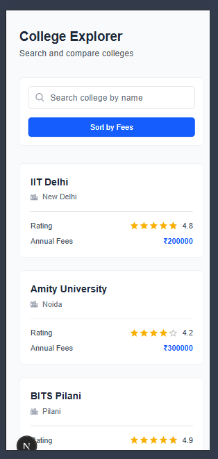
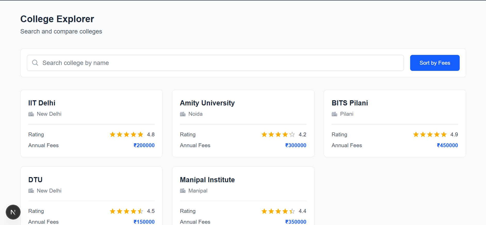
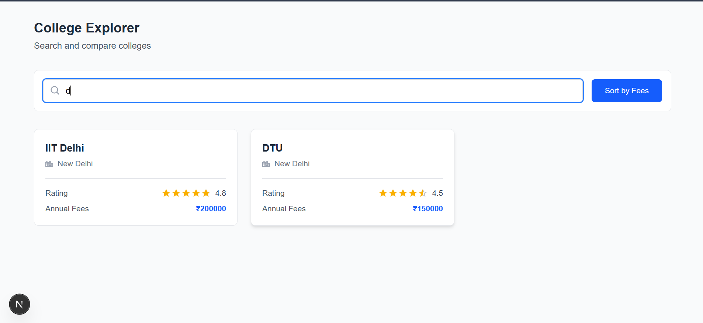

# 🎓 College Explorer App

This repository contains a simple, responsive **College Explorer web application** built using **Next.js** and **Tailwind CSS**. The application allows users to browse a list of colleges, search by name, and sort colleges based on annual fees.

---

## ✨ Features

- **College Listing:** Displays colleges as responsive cards.
- **Search Functionality:** Real-time filtering by college name.
- **Sorting:** Sort colleges by annual fees (Low → High).
- **Reusable Components:** Clean separation using `SearchBar` and `CollegeCard`.
- **Responsive Design:**  
  - Desktop: 3 cards per row  
  - Tablet: 2 cards per row  
  - Mobile: 1 card per row
- **Visual Enhancements:** City icons and star-based ratings.

---

## 🛠️ Technology Stack

- **Framework:** Next.js 
- **Language:** JavaScript
- **Styling:** Tailwind CSS
- **Icons:** react-icons
- **UI Component:** Material UI (`Rating`)

---

## 📂 Project Structure
```
college-explorer/
├── app/
│ └── page.js # Main page (search, sort, layout)
├── components/
│ ├── SearchBar.jsx # Search input with icon & sort button
│ └── CollegeCard.jsx # Individual college card UI
├── data/
│ └── colleges.js # Mock college data
├── public/
├── package.json
├── tailwind.config.js
└── README.md
```

### Installation Steps

1. **Clone the Repository**

```bash
git clone https://github.com/nxtnilesh/matchtocollege.git
cd matchtocollege
```
```
npm i
npm run dev
```
---
## 📸 Screenshots

### 1. Mobile View


---

### 2. Desktop View


---

### 3. Search & Filter View


***

